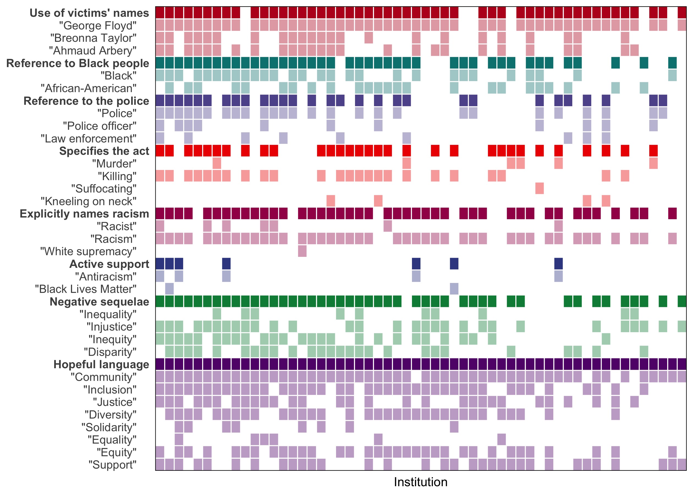

<!-- README.md is generated from README.Rmd. Please edit that file -->

## Statements issued by academic medical institutions after George Floyd’s killing by police and subsequent unrest in the United States: cross-sectional study

## Introduction

Analytic code and additional analyses for our *Annals of Epidemiology*
paper, [*Failure of leadership in U.S. academic medicine after George
Floyd’s killing by police and amidst subsequent
unrest*](https://doi.org/10.1016/j.annepidem.2021.04.018). The full
citation is:

> Kiang MV & Tsai AC, Failure of leadership in U.S. academic medicine
> after George Floyd’s killing by police and amidst subsequent unrest.
> *Annals of Epidemiology* (May 2020), doi:
> [10.1101/2020.06.22.20137844](https://doi.org/10.1101/2020.06.22.20137844)

The pre-print version can be found [on
*medRxiv*](https://www.medrxiv.org/content/10.1101/2020.06.22.20137844v1).

## Structure

-   `code`: contains code files to be run in sequential order with the
    exception of `00_rerun_everything.R`
-   `data`: contains publicly shareable data
-   `data_private` (not on Github): contains full, private data
-   `plots`: contains publicly shareable plots
-   `plots_private` (not on Github): contains plots with identifiers for
    manual verification
-   `rmds`: contains rmarkdown files with additional analyses and/or
    explanation

## Additional analyses

Note, the HTML links below will not render interactive tables. You must
download the file and view it locally.

-   [Descriptives (including list of
    institutions)](https://htmlpreview.github.io/?https://github.com/mkiang/statement_analysis/blob/master/rmds/01_descriptives.html)
    ([Source
    RMD](https://github.com/mkiang/statement_analysis/blob/master/rmds/01_descriptives.Rmd)
    \| [Source
    HTML](https://github.com/mkiang/statement_analysis/blob/master/rmds/01_descriptives.html))
-   [Evaluating
    statements](https://htmlpreview.github.io/?https://github.com/mkiang/statement_analysis/blob/master/rmds/02_evaluating_statements.html)
    ([Source
    RMD](https://github.com/mkiang/statement_analysis/blob/master/rmds/02_evaluating_statements.Rmd)
    \| [Source
    HTML](https://github.com/mkiang/statement_analysis/blob/master/rmds/02_evaluating_statements.html))

## Authors

-   [Alexander
    Tsai](https://connects.catalyst.harvard.edu/Profiles/display/Person/90553)
    (:
    [@drdrtsai](https://twitter.com/drdrtsai))
-   [Mathew Kiang](https://mathewkiang.com)
    (:
    [mkiang](https://github.com/mkiang) \|
    :
    [@mathewkiang](https://twitter.com/mathewkiang))

## Session information

We use `renv` to manage local packages and ensure reproducibility as we
update analyses and data. For completeness, a continuously-current
version of the session information can be viewed at
`./session_info.txt`.
